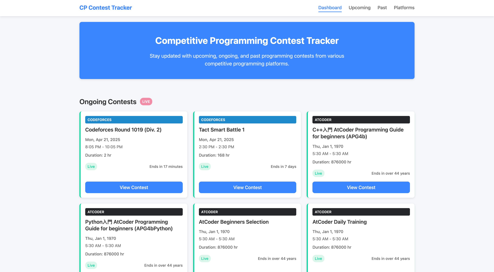
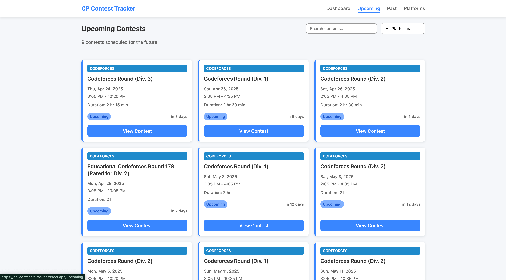
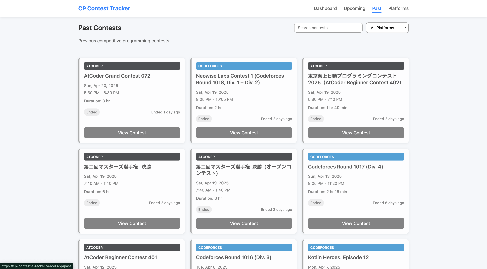
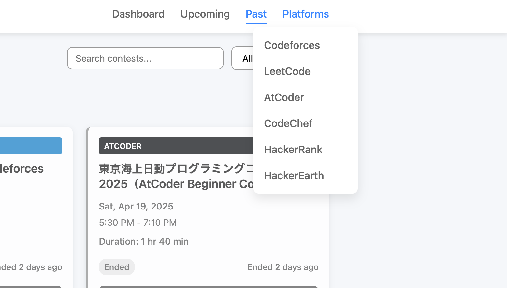

# 🧭 CP Contest Tracker

**CP Contest Tracker** is a responsive React-based web app that helps competitive programmers stay updated with upcoming and past contests from platforms like Codeforces, AtCoder, LeetCode, and others.

🔗 **Live Demo:** [https://cp-contest-t-racker.vercel.app](https://cp-contest-t-racker.vercel.app)

---

## 📌 Description

The app fetches contest data from various coding platforms and presents it in an organized UI. It includes dedicated sections for:

- **Dashboard:** Overview of all features
- **Upcoming Contests:** Stay ahead with future contests
- **Past Contests:** View historical contests
- **Platform-wise Contests:** Filter contests by platform

---

## 🚀 Tech Stack

| Tech           | Purpose                        |
|----------------|--------------------------------|
| React          | UI building                    |
| React Router   | Navigation between pages       |
| Vite           | Development server & bundler   |
| JavaScript     | Application logic              |
| CSS            | Styling and layout             |

---

## 📸 Screenshots

### 🏠 Dashboard

### 📅 Upcoming Contests

### ⏳ Past Contests

### 🧩 Platform-wise Contests

